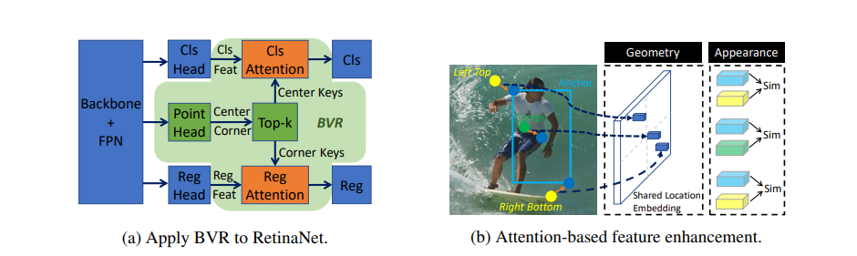

# RelationNet++: Bridging Visual Representations for Object Detection via Transformer Decoder
by Chi, Cheng and Wei, Fangyun and Hu, Han
## Introduction
Existing object detection frameworks are usually built on a single format of objject/part representation, i.e., anchor/proposal rectangle boxes in RetinaNet and
Faster R-CNN, center points in FCOS and RepPoints, and corner points in CornerNet. While these different representations usually drive the frameworks to perform
well in different aspects, e.g., better classification or finer localization, it is in general difficult to combine these representations in a single framework to make good
use of each strength, due to the heterogeneous or non-grid feature extraction by different representations. This paper presents an attention-based decoder module
similar as that in Transformer to bridge other representations into a typical object detector built on a single representation format, in an end-to-end fashion. The other representations act as a set of key instances to strengthen the main query representation features in the vanilla detectors. Novel techniques are proposed towards efficient computation of the decoder module, including a key sampling approach and a shared location embedding approach. The proposed module is named bridging visual representations (BVR).

<div align="center">
  
</div>

## Main Results:

|Model|MS Train|MS Test|mAP|AP50|AP75|Link|
|----|-------|-----|----|---|---|---|
|[retinanet_bvr_r50](configs/bvr/retinanet_r50_fpn_relation_coco_1x.py)|N|N|0.385 |0.591 |0.409|[Google](https://drive.google.com/file/d/1iKygKRi6EmqRsEQgBhJTfToWweVXEltB/view?usp=sharing)|
|[retinanet_bvr_x101_dcn](configs/bvr/retinanet_x101_dcn_fpn_relation_coco_2x.py)|Y|N|0.465| 0.663| 0.506|[Google](https://drive.google.com/file/d/1YyAG9OAjkeWStGkM5kLy6l95tXEa_E_b/view?usp=sharing)|
|[fcos_bvr_x101_dcn](configs/bvr/fcos_x101_dcn_fpn_relation_coco_2x.py)|Y|N|0.487| 0.680| 0.529|[Google](https://drive.google.com/file/d/1IT1YBnNLrGQs-Be_drfF2ntEq4OjtCaO/view?usp=sharing)|
|[atss_bvr_x101_dcn](configs/bvr/atss_x101_dcn_fpn_relation_coco_2x.py)|Y|N|0.506 |0.695| 0.553|[Google](https://drive.google.com/file/d/16kTxTPGIN4O4wFHKhJMdFP_rlZ7eXde9/view?usp=sharing)|
## How to use it
- ### Install it
```shell
bash install.sh ${your_code_dir}
cd ${your_code_dir}
mkdir -p data 
ln -s ${your_coco_path} data/coco
```
where `your_code_dir` is your code path and `your_coco_path` is the location of extracted coco dataset on your server. For more information, you may refer to [getting started](https://github.com/open-mmlab/mmdetection/blob/master/docs/get_started.md)
- ### For testing
```shell
bash tools/dist_test.sh ${selected_config} 8
```
where `selected_config` is one of provided script under the `config/bvr` folder.
- ### For training
```shell
bash tools/dist_train.sh ${selected_config} 8
```
where `selected_config` is one of provided script under the `config/bvr` folder.
- ### For more dataset
We have not trained or tested on other dataset. If you would like to use it on other data, please refer to [mmdetection](https://github.com/open-mmlab/mmdetection/blob/master/docs/1_exist_data_model.md).
## Citing RelationNet++

```
@inproceedings{relationnetplusplus2020,
  title={RelationNet++: Bridging Visual Representations for Object Detection via Transformer Decoder},
  author={Chi, Cheng and Wei, Fangyun and Hu, Han},
  booktitle={NeurIPS},
  year={2020}
}
```

## Contributing

This project welcomes contributions and suggestions.  Most contributions require you to agree to a
Contributor License Agreement (CLA) declaring that you have the right to, and actually do, grant us
the rights to use your contribution. For details, visit https://cla.opensource.microsoft.com.

When you submit a pull request, a CLA bot will automatically determine whether you need to provide
a CLA and decorate the PR appropriately (e.g., status check, comment). Simply follow the instructions
provided by the bot. You will only need to do this once across all repos using our CLA.

This project has adopted the [Microsoft Open Source Code of Conduct](https://opensource.microsoft.com/codeofconduct/).
For more information see the [Code of Conduct FAQ](https://opensource.microsoft.com/codeofconduct/faq/) or
contact [opencode@microsoft.com](mailto:opencode@microsoft.com) with any additional questions or comments.

## Trademarks

This project may contain trademarks or logos for projects, products, or services. Authorized use of Microsoft 
trademarks or logos is subject to and must follow 
[Microsoft's Trademark & Brand Guidelines](https://www.microsoft.com/en-us/legal/intellectualproperty/trademarks/usage/general).
Use of Microsoft trademarks or logos in modified versions of this project must not cause confusion or imply Microsoft sponsorship.
Any use of third-party trademarks or logos are subject to those third-party's policies.


